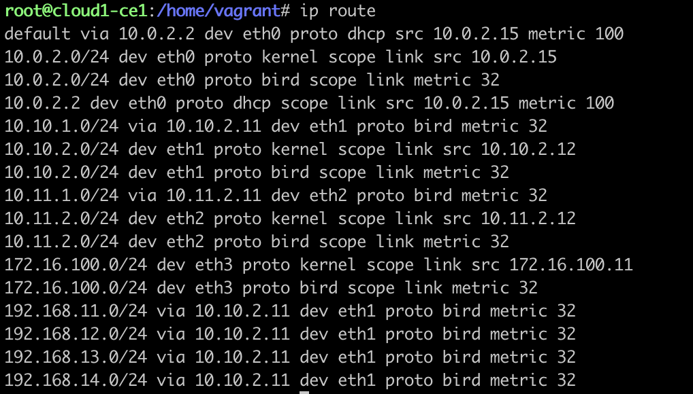

# BGP and OSPF practical activity
### Results
Results on **cloud1-ce1**

Results on **cust1-core**

`ip route`:
1. **cust1-core**
   
1. **cust1-ce1**
   
1. **cust1-ce2**
   
1. **sp1-p1**
   
1. **sp2-p1**
   
1. **cloud1-ce1**
   
